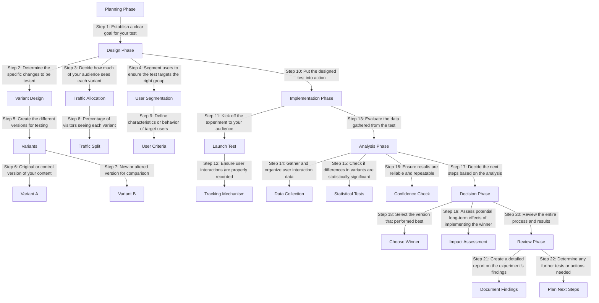

```mermaid
graph TD
  A[Planning Phase] -->|Step 1: Establish a clear goal for your test| B[Design Phase]
  B -->|Step 2: Determine the specific changes to be tested| C1[Variant Design]
  B -->|Step 3: Decide how much of your audience sees each variant| C2[Traffic Allocation]
  B -->|Step 4: Segment users to ensure the test targets the right group| C3[User Segmentation]
  C1 -->|Step 5: Create the different versions for testing| D[Variants]
  D -->|Step 6: Original or control version of your content| E1[Variant A]
  D -->|Step 7: New or altered version for comparison| E2[Variant B]
  C2 -->|Step 8: Percentage of visitors seeing each variant| F[Traffic Split]
  C3 -->|Step 9: Define characteristics or behavior of target users| G[User Criteria]
  B -->|Step 10: Put the designed test into action| H[Implementation Phase]
  H -->|Step 11: Kick off the experiment to your audience| I[Launch Test]
  I -->|Step 12: Ensure user interactions are properly recorded| J[Tracking Mechanism]
  H -->|Step 13: Evaluate the data gathered from the test| K[Analysis Phase]
  K -->|Step 14: Gather and organize user interaction data| L1[Data Collection]
  K -->|Step 15: Check if differences in variants are statistically significant| L2[Statistical Tests]
  K -->|Step 16: Ensure results are reliable and repeatable| L3[Confidence Check]
  K -->|Step 17: Decide the next steps based on the analysis| M[Decision Phase]
  M -->|Step 18: Select the version that performed best| N[Choose Winner]
  M -->|Step 19: Assess potential long-term effects of implementing the winner| O[Impact Assessment]
  M -->|Step 20: Review the entire process and results| P[Review Phase]
  P -->|Step 21: Create a detailed report on the experiment's findings| Q[Document Findings]
  P -->|Step 22: Determine any further tests or actions needed| R[Plan Next Steps]
```
